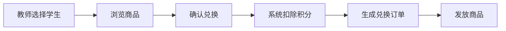
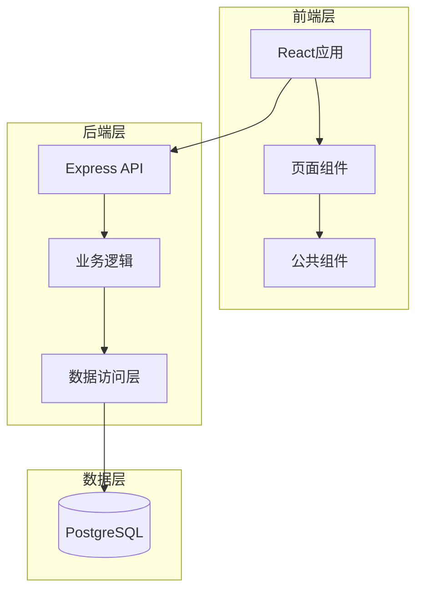
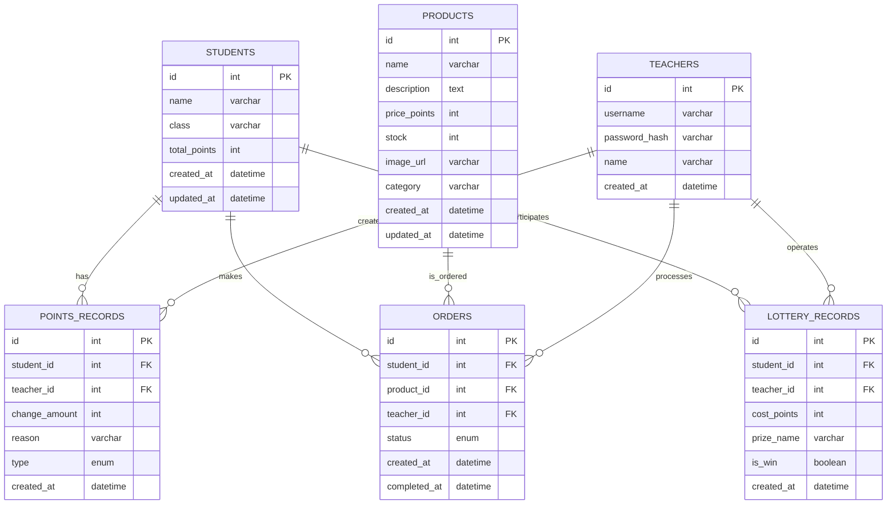

# 学生积分商城 - 产品需求文档

## 1. 产品概述

### 1.1 项目背景
本系统是面向学校学生的积分商城平台，旨在通过积分激励机制，奖励学生的学习表现和成绩，促进学生积极进取。积分兑换全程由教师操作管理。

### 1.2 目标用户
- **学生**：积分获取者，可查看个人积分、浏览商品、查看兑换/抽奖记录
- **教师**：积分管理者，负责积分发放、商品管理、订单处理、抽奖操作

### 1.3 核心价值
- 激发学生学习积极性，促进良好学习习惯养成
- 提供公平透明的积分管理和兑换体系
- 减轻教师手工记录积分的负担

---

## 2. 核心功能

### 2.1 用户角色与权限

| 角色 | 核心权限 | 操作场景 |
|------|----------|----------|
| **学生** | 查看个人积分、浏览商品、查看兑换记录、查看抽奖记录 | 被动获取积分，了解积分使用情况 |
| **教师** | 管理学生信息、发放/扣除积分、管理商品库、处理兑换订单、操作抽奖、Excel导入积分 | 主动发放积分，管理商城运营 |

### 2.2 功能模块

| 模块 | 功能描述 |
|------|----------|
| **积分管理** | 教师给学生增加/扣除积分、记录操作原因、积分变动历史查询 |
| **商品管理** | 商品增删改查、库存管理、商品分类 |
| **订单管理** | 兑换订单创建、状态管理、订单记录查询 |
| **抽奖功能** | 抽奖规则设置、抽奖操作、中奖记录 |
| **Excel导入** | 批量导入学生信息、批量同步积分数据 |
| **学生管理** | 学生信息增删改查、积分排名 |

### 2.3 页面详情

| 页面名称 | 模块名称 | 功能描述 |
|----------|----------|----------|
| **首页** | 积分概览 | 展示学生当前积分、可用积分、积分获取记录 |
| **商品列表页** | 商品浏览 | 展示可兑换商品列表，支持分类筛选 |
| **商品详情页** | 商品详情 | 展示商品信息、所需积分、兑换按钮（教师操作） |
| **积分管理页** | 积分操作 | 教师给学生增加/扣除积分，记录操作原因 |
| **订单管理页** | 订单处理 | 查看兑换订单列表，处理兑换请求 |
| **抽奖页面** | 抽奖功能 | 设置抽奖规则，执行抽奖操作 |
| **学生管理页** | 学生信息 | 查看学生列表、积分排名 |
| **积分导入页** | Excel导入 | 上传Excel文件，预览数据，批量同步学生积分 |
| **登录页面** | 用户认证 | 教师登录系统 |

---

## 3. 核心流程

### 3.1 积分获取流程

### 3.2 积分兑换流程

### 3.3 抽奖流程

### 3.4 Excel导入流程

---

## 4. 用户界面设计

### 4.1 设计风格
- **主色调**：蓝色系（#1E90FF），体现校园活力与专业感
- **辅助色**：橙色（#FFA500）用于强调和按钮
- **按钮风格**：圆角矩形，hover效果
- **字体**：微软雅黑/思源黑体，清晰易读
- **布局**：卡片式布局，简洁清晰

### 4.2 页面设计概述

| 页面名称 | 模块名称 | UI元素 |
|----------|----------|--------|
| 首页 | 积分卡片 | 大数字展示积分，积分变动趋势图 |
| 商品列表 | 商品卡片 | 商品图片、名称、所需积分 |
| 积分管理 | 操作表单 | 学生选择、积分数量、备注原因 |
| 抽奖页面 | 抽奖转盘 | 可视化转盘动画，奖品展示 |
| 积分导入 | 文件上传 | 文件选择、预览表格、导入按钮 |

### 4.3 响应式设计
- 支持桌面端和移动端访问
- 教师端以桌面为主，学生端支持移动查看

---

## 5. 技术架构

### 5.1 架构设计

### 5.2 技术栈

| 层级 | 技术 | 版本 |
|------|------|------|
| 前端框架 | React | 18.x |
| 构建工具 | Vite | 6.x |
| 样式 | TailwindCSS | 3.x |
| 图标 | Lucide React | 最新 |
| 后端框架 | Express | 4.x |
| 数据库 | PostgreSQL | 15.x |
| Excel处理 | xlsx | 最新 |
| 认证 | JWT | 最新 |

### 5.3 路由定义

| 路径 | 页面 | 权限 | 说明 |
|------|------|------|------|
| `/` | 首页（学生积分概览） | 学生/教师 | 默认首页 |
| `/products` | 商品列表页 | 学生/教师 | 浏览可兑换商品 |
| `/products/:id` | 商品详情页 | 教师 | 查看商品详情，执行兑换 |
| `/teacher/students` | 学生管理页 | 教师 | 管理学生信息和积分 |
| `/teacher/points` | 积分操作页 | 教师 | 给学生增减积分 |
| `/teacher/orders` | 订单管理页 | 教师 | 查看和处理兑换订单 |
| `/teacher/lottery` | 抽奖页面 | 教师 | 执行抽奖操作 |
| `/teacher/import` | 积分导入页 | 教师 | 上传Excel文件批量同步积分 |
| `/login` | 登录页面 | 匿名 | 教师登录 |

### 5.4 数据模型

#### 5.4.1 ER图

#### 5.4.2 核心表结构

**students 表**
| 字段名 | 类型 | 说明 |
|--------|------|------|
| id | SERIAL | 主键 |
| name | VARCHAR(100) | 学生姓名 |
| class | VARCHAR(50) | 班级 |
| total_points | INT | 当前积分 |
| created_at | TIMESTAMP | 创建时间 |
| updated_at | TIMESTAMP | 更新时间 |

**teachers 表**
| 字段名 | 类型 | 说明 |
|--------|------|------|
| id | SERIAL | 主键 |
| username | VARCHAR(50) | 用户名 |
| password_hash | VARCHAR(255) | 密码哈希 |
| name | VARCHAR(100) | 教师姓名 |
| created_at | TIMESTAMP | 创建时间 |

**products 表**
| 字段名 | 类型 | 说明 |
|--------|------|------|
| id | SERIAL | 主键 |
| name | VARCHAR(100) | 商品名称 |
| description | TEXT | 商品描述 |
| price_points | INT | 所需积分 |
| stock | INT | 库存数量 |
| image_url | VARCHAR(255) | 商品图片 |
| category | VARCHAR(50) | 商品分类 |
| created_at | TIMESTAMP | 创建时间 |
| updated_at | TIMESTAMP | 更新时间 |

**points_records 表**
| 字段名 | 类型 | 说明 |
|--------|------|------|
| id | SERIAL | 主键 |
| student_id | INT | 学生ID |
| teacher_id | INT | 教师ID |
| change_amount | INT | 积分变动量 |
| reason | VARCHAR(255) | 变动原因 |
| type | VARCHAR(20) | 类型(award/deduct/redeem/lottery) |
| created_at | TIMESTAMP | 创建时间 |

**orders 表**
| 字段名 | 类型 | 说明 |
|--------|------|------|
| id | SERIAL | 主键 |
| student_id | INT | 学生ID |
| product_id | INT | 商品ID |
| teacher_id | INT | 教师ID |
| status | VARCHAR(20) | 状态(pending/completed/cancelled) |
| created_at | TIMESTAMP | 创建时间 |
| completed_at | TIMESTAMP | 完成时间 |

**lottery_records 表**
| 字段名 | 类型 | 说明 |
|--------|------|------|
| id | SERIAL | 主键 |
| student_id | INT | 学生ID |
| teacher_id | INT | 教师ID |
| cost_points | INT | 消耗积分 |
| prize_name | VARCHAR(100) | 奖品名称 |
| is_win | BOOLEAN | 是否中奖 |
| created_at | TIMESTAMP | 创建时间 |

---

## 6. API接口设计

### 6.1 认证接口

| API路径 | 方法 | 功能 |
|---------|------|------|
| `/api/auth/login` | POST | 教师登录 |
| `/api/auth/me` | GET | 获取当前登录教师信息 |

### 6.2 学生管理接口

| API路径 | 方法 | 功能 |
|---------|------|------|
| `/api/students` | GET | 获取学生列表 |
| `/api/students` | POST | 创建学生 |
| `/api/students/:id` | GET | 获取学生详情 |
| `/api/students/:id` | PUT | 更新学生信息 |
| `/api/students/:id` | DELETE | 删除学生 |
| `/api/students/:id/points-history` | GET | 获取学生积分变动历史 |

### 6.3 商品管理接口

| API路径 | 方法 | 功能 |
|---------|------|------|
| `/api/products` | GET | 获取商品列表 |
| `/api/products/categories` | GET | 获取商品分类 |
| `/api/products/:id` | GET | 获取商品详情 |
| `/api/products` | POST | 创建商品 |
| `/api/products/:id` | PUT | 更新商品信息 |
| `/api/products/:id` | DELETE | 删除商品 |

### 6.4 订单管理接口

| API路径 | 方法 | 功能 |
|---------|------|------|
| `/api/orders` | GET | 获取订单列表 |
| `/api/orders` | POST | 创建订单（兑换商品） |
| `/api/orders/:id` | GET | 获取订单详情 |
| `/api/orders/:id` | PUT | 更新订单状态 |

### 6.5 抽奖接口

| API路径 | 方法 | 功能 |
|---------|------|------|
| `/api/lottery/prizes` | GET | 获取奖品列表 |
| `/api/lottery/draw` | POST | 执行抽奖 |
| `/api/lottery/records` | GET | 获取抽奖记录 |

### 6.6 积分管理接口

| API路径 | 方法 | 功能 |
|---------|------|------|
| `/api/points/award` | POST | 发放积分 |
| `/api/points/deduct` | POST | 扣除积分 |
| `/api/points/import` | POST | 上传Excel文件并解析 |
| `/api/points/import/confirm` | POST | 确认导入并更新积分 |

---

## 7. 非功能需求

### 7.1 安全性
- 教师操作需登录验证
- 所有操作记录可追溯
- 密码采用加密存储

### 7.2 易用性
- 界面简洁直观
- 教师操作流程不超过3步完成核心任务
- 响应时间小于2秒

### 7.3 数据一致性
- 积分变动实时更新
- 库存扣减保证一致性
- 避免数据不一致

---

## 8. 初始化数据

### 8.1 默认管理员账号
- 用户名：admin
- 密码：admin123

### 8.2 默认商品数据
| 商品名称 | 描述 | 所需积分 | 库存 | 分类 |
|----------|------|----------|------|------|
| 笔记本 | 精美笔记本一本 | 50 | 100 | 学习用品 |
| 钢笔 | 高档钢笔一支 | 100 | 50 | 学习用品 |
| 书包 | 时尚双肩书包 | 300 | 30 | 学习用品 |
| 文具盒 | 多功能文具盒 | 80 | 80 | 学习用品 |
| 运动水杯 | 大容量运动水杯 | 120 | 40 | 生活用品 |
| 卡通贴纸 | 可爱卡通贴纸套装 | 30 | 200 | 生活用品 |
| 书签 | 精美书签套装 | 40 | 150 | 生活用品 |
| 奖状 | 荣誉奖状一张 | 20 | 500 | 荣誉奖品 |

---

## 9. 项目计划

### 9.1 开发阶段

| 阶段 | 时间 | 任务 |
|------|------|------|
| 第一阶段 | 1周 | 环境搭建、数据库设计、基础架构 |
| 第二阶段 | 2周 | 后端API开发、前端页面开发 |
| 第三阶段 | 1周 | 功能测试、Bug修复、性能优化 |
| 第四阶段 | 1周 | 用户验收、部署上线 |

---

**文档版本**：v1.0  
**创建日期**：2026年6月  
**最后更新**：2026年6月
